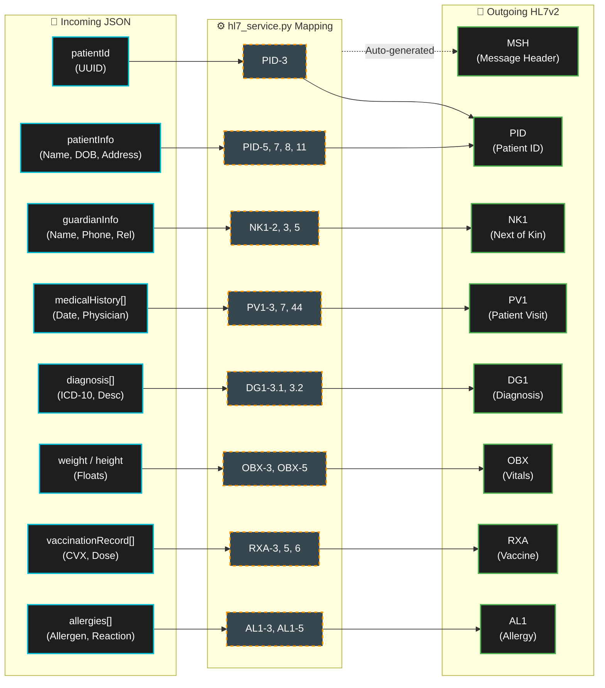

# HL7v2 Data Mapping and Exchange Logic

This document details the architectural data mapping between our internal JSON structures (originating from the offline-first mobile app) and the international HL7v2 standard segments. 

The transformation is handled strictly by the `hl7_service.py` component before transmission to the Google Cloud Healthcare API.

## HL7v2 Data Dictionary & Field Mapping

### 1. PID Segment (Patient Identification)
Maps core demographic information.
* **PID-3 (Patient Identifier List):** Mapped directly to our internal `patientId` (UUID).
* **PID-5 (Patient Name):** * `PID-5.1`: Family Name (`patientInfo.lastName`)
  * `PID-5.2`: Given Name (`patientInfo.firstName`)
* **PID-7 (Date/Time of Birth):** Formatted as YYYYMMDD from `patientInfo.dob`.
* **PID-8 (Administrative Sex):** Mapped from `patientInfo.gender` (M, F, U).
* **PID-11 (Patient Address):**
  * `PID-11.1`: Street Address (`patientInfo.address.street`)
  * `PID-11.3`: City (`patientInfo.address.city`)
  * `PID-11.4`: State or Province (`patientInfo.address.state`)
  * `PID-11.5`: Zip or Postal Code (`patientInfo.address.zipCode`)
  * `PID-11.6`: Country (`patientInfo.address.country`)

### 2. NK1 Segment (Next of Kin / Associated Parties)
Maps the legal guardian information, crucial for pediatric patients.
* **NK1-2 (Name):** Guardian's full name (`guardianInfo.name`).
* **NK1-3 (Relationship):** E.g., Mother, Father, Aunt (`guardianInfo.relationship`).
* **NK1-5 (Phone Number):** Contact number (`guardianInfo.phone`).

### 3. PV1 Segment (Patient Visit)
Maps the episodic data of the medical encounter.
* **PV1-3 (Assigned Patient Location):** Where the encounter took place (`medicalHistory[].location`).
* **PV1-7 (Attending Doctor):** Name of the physician (`medicalHistory[].physician`).
* **PV1-44 (Admit Date/Time):** Date of the consultation (`medicalHistory[].date`).

### 4. DG1 Segment (Diagnosis)
Maps the clinical diagnoses extracted via NLP or manual input.
* **DG1-3 (Diagnosis Code - ICD-10):**
  * `DG1-3.1`: The actual ICD-10 Code (`diagnosis[].icd10Code`).
  * `DG1-3.2`: Text description of the diagnosis (`diagnosis[].description`).
* **DG1-6 (Diagnosis Type):** Hardcoded to "F" for Final diagnosis.

### 5. OBX Segment (Observation/Result - Vitals)
Used generically to map physical measurements.
* **OBX-3 (Observation Identifier):** Uses international LOINC codes (e.g., `29463-7` for Weight, `8302-2` for Height).
* **OBX-5 (Observation Value):** The float value (`patientInfo.weight` or `patientInfo.height`).
* **OBX-6 (Units):** "kg" for weight, "cm" for height.

### 6. RXA Segment (Pharmacy/Treatment Administration)
Maps the vaccination history.
* **RXA-3 & RXA-4 (Date/Time Start & End):** Date the vaccine was administered (`vaccinationRecord[].date`).
* **RXA-5 (Administered Code):** Uses CVX codes (`vaccineCode`) and the vaccine's text name (`vaccineName`).
* **RXA-6 (Administered Amount):** Number of doses (`vaccinationRecord[].dose`).
* **RXA-10 (Administering Provider):** Who applied the vaccine (`vaccinationRecord[].administratedBy`).

### 7. AL1 Segment (Patient Allergy Information)
Maps known allergies and adverse reactions.
* **AL1-3 (Allergen Code/Description):** General description of the allergen (`allergies[].allergen`).
* **AL1-5 (Allergy Reaction):** The clinical manifestation (e.g., "Habones", "Choque anafiláctico") mapped from the `AllergyReactionEnum` (`allergies[].reaction`).

## Data Mapping Architecture

## Exchange Logic Flow

1. **Ingestion:** The FastAPI backend receives the strongly-typed Pydantic payload (`PatientFullRecord`).
2. **Translation:** The `hl7_service.py` initiates the `hl7apy` library to instantiate an empty message.
3. **Mapping:** 
* Static demographic data is mapped to `PID` and `NK1`.
* Dynamic arrays (visits, vaccines, allergies) are iterated over, dynamically appending `PV1`, `DG1`, `RXA`, and `AL1` segments.

4. **Transmission:** The constructed HL7 string is Base64 encoded and securely transmitted via REST to the Google Cloud Healthcare API HL7v2 Store.
