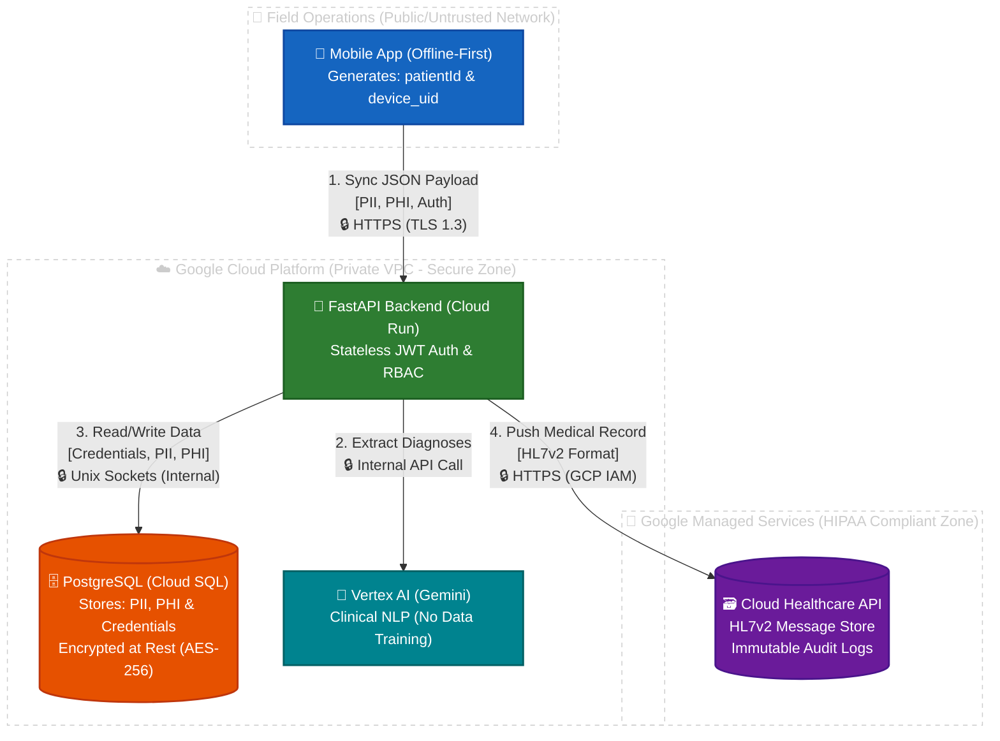

# Security Architecture & Protocols

This document outlines the security measures, cryptographic standards, and access control models implemented in the **Health Without Borders API**. The system follows a strict "Defense in Depth" strategy, securing Protected Health Information (PHI) and Personally Identifiable Information (PII) at the application, transport, and storage levels.

---

## 1. Authentication (AuthN)

Authentication is handled via the **OAuth2** standard using the **Password Flow**. This approach facilitates seamless integration with mobile and tablet clients operating in disconnected environments.

### 1.1. Token Management
* **Mechanism:** Stateless authentication is achieved using **JSON Web Tokens (JWT)**.
* **Signing Algorithm:** Tokens are signed using **HS256** (HMAC with SHA-256) utilizing a high-entropy `SECRET_KEY` injected securely at runtime.
* **Payload Privacy:** The token payload strictly contains the user's subject identifier (`sub` / email) and expiration time (`exp`). **No sensitive medical data or PII is ever included in the token payload.**
* **Expiration Policy:** Access tokens are configured with an extended **30-day lifespan** (`ACCESS_TOKEN_EXPIRE_MINUTES = 43200`) to support health units in border areas with severe, intermittent internet connectivity.

### 1.2. Credential Storage
* **Hashing:** User passwords are **never** stored in plaintext. They are secured using iterative **Bcrypt** hashing.

---

## 2. Authorization (AuthZ) & Multi-Tenancy

Access control is enforced via a robust **Role-Based Access Control (RBAC)** model combined with **Multi-Tenant Isolation**. 

### 2.1. System Roles
1.  **superadmin:** Global administrator. Can create new Organizations (Tenants) and provision `org_admin` users across the entire system.
2.  **org_admin:** Tenant administrator. Can only create and manage `doctor` and `nurse` accounts within their *own* specific organization.
3.  **doctor:** Full clinical access within their organization. Can read patient records, create new patients, and append full medical history and diagnoses.
4.  **nurse:** Restricted clinical access. Can read patient records and append vaccines, but is strictly prohibited from adding or modifying medical history (diagnoses/clinical evaluations).

### 2.2. Patient Authorization (Hardware 2FA)
For extreme physical security in refugee or transit camps, the system enforces a hardware-based verification mechanism during patient lookup (`GET /api/v1/patients/scan/{device_uid}`):
* **Adults (18+):** Scanning the patient's NFC tag/bracelet retrieves their medical record.
* **Minors (< 18):** The system calculates the age dynamically. If the patient is a minor, the endpoint mathematically blocks access unless the `guardian_device_uid` (the NFC tag of the legal guardian) is also scanned and provided in the request. This prevents unauthorized access to a separated child's medical history.

---

## 3. Data & Clinical Security

### 3.1. Encryption at Rest
* **Relational Data:** The PostgreSQL database hosted on **Google Cloud SQL** is encrypted at rest by default using Google-managed AES-256 keys.
* **Automated Backups:** All automated snapshots and backups generated by Cloud SQL are identically encrypted.

### 3.2. Encryption in Transit
* **HTTPS/TLS 1.3:** All external communication between the mobile clients and the Cloud Run backend is strictly encrypted via **TLS 1.3**.
* **Internal VPC Traffic:** The connection between the Application Container (Cloud Run) and the Database (Cloud SQL) is secured using **Unix Sockets**.

### 3.3. Clinical Interoperability Security (HL7v2)
Clinical messages routed to the **Google Cloud Healthcare API** are protected under stringent compliance standards (HIPAA/GDPR-ready):
* **IAM Service Accounts:** The backend uses a strictly scoped Service Account possessing only the `roles/healthcare.hl7V2StoreEditor` permission.
* **Cloud Audit Logs:** Every ingestion, read, or deletion of an HL7v2 message triggers an immutable log entry in Google Cloud Audit Logging.

---

## 4. Infrastructure Security

The infrastructure is designed to minimize the attack surface by leveraging stateless, serverless technologies.

### 4.1. Network Isolation
* **No Public Database IP:** The Cloud SQL instance does not have a public IP address enabled. It is accessed exclusively via secure GCP tunnels or internal VPC routing.
* **Ephemeral Compute:** Google Cloud Run instances are ephemeral, effectively neutralizing advanced persistent threats (APTs) or long-term malware residency.

### 4.2. Secret Management
* **Environment Injection:** Sensitive configurations (Database URIs, JWT Secret Keys) are securely injected at runtime via **Google Secret Manager**.
* **Zero-Trust Source Control:** No secrets are ever committed to the Git repository. 

---

## 5. Data Map & Flow

### 1. Data Classification
* **Authentication Data (Sensitive):** Emails, hashed passwords, roles, and organization IDs.
* **PII (Personally Identifiable Information):** Patient's full name, date of birth, and guardian's names.
* **PHI (Protected Health Information - Critical):** Patient ID, hardware device UIDs, weight, height, and the complete medical history (including LLM-generated ICD-10/11 diagnoses and CVX vaccines).

### 2. Data Flow (Where does it travel?)
1. **Origin (Frontend):** The tablet generates the JSON payload.
2. **Transit 1 (Internet to Cloud):** The tablet sends the JSON to the Backend (`POST /api/v1/patients/sync`) via **TLS 1.3 (HTTPS)**.
3. **Processing (Backend & AI):** Cloud Run validates the JWT and RBAC. Missing diagnoses are securely inferred using **Google Vertex AI** (with data-training explicitly disabled for privacy).
4. **Transit 2 (Backend to Database):** Cloud Run saves the data to PostgreSQL via internal **Unix Sockets**.
5. **Transit 3 (Backend to Interoperability):** The Backend converts the JSON to HL7v2 and pushes it to the Cloud Healthcare API via **GCP IAM Service Accounts**.

---

## 6. ISO 27001 Traceability

Technical control traceability for ISO/IEC 27001 is documented in:

- `docs/infrastructure/iso27001-technical-mapping.md`

This mapping links code/config evidence to Annex A themes and highlights residual non-code gaps that require governance and operational controls.

---
