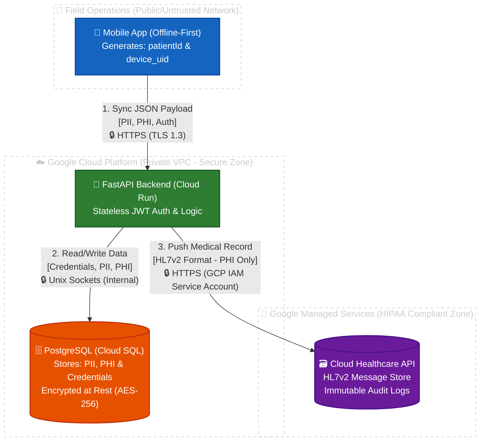

# Security Architecture & Protocols

This document outlines the security measures, cryptographic standards, and access control models implemented in the **Health Without Borders API**. The system follows a strict "Defense in Depth" strategy, securing Protected Health Information (PHI) and Personally Identifiable Information (PII) at the application, transport, and storage levels.

---

## 1. Authentication (AuthN)

Authentication is handled via the **OAuth2** standard using the **Password Flow**. This approach facilitates seamless integration with mobile and tablet clients operating in disconnected environments.

### 1.1. Token Management
* **Mechanism:** Stateless authentication is achieved using **JSON Web Tokens (JWT)**.
* **Signing Algorithm:** Tokens are signed using **HS256** (HMAC with SHA-256) utilizing a high-entropy `SECRET_KEY` injected securely at runtime.
* **Payload Privacy:** The token payload strictly contains the user's subject identifier (`sub` / email) and expiration time (`exp`). **No sensitive medical data or PII is ever included in the token payload.**
* **Expiration Policy:** Access tokens are configured with an extended **30-day lifespan** (`ACCESS_TOKEN_EXPIRE_MINUTES = 43200`).
    * *Architectural Rationale:* This extended duration is a specific requirement to support health units in border areas with severe, intermittent internet connectivity. It allows medical staff to operate locally (offline-first) for extended periods without forced network-dependent re-authentication.

### 1.2. Credential Storage
* **Hashing:** User passwords are **never** stored in plaintext.
* **Algorithm:** **Bcrypt** is utilized for password hashing.

---

## 2. Authorization (AuthZ)

Access control is enforced via a **Role-Based Access Control (RBAC)** model. Authorization logic is decoupled from business logic using FastAPI's Dependency Injection system.

### 2.1. System Roles
1.  **Admin:** Full access to user management (provisioning doctors/coordinators) and system-wide configuration.
2.  **Doctor:** Operational access limited to patient records, synchronization endpoints, and medical catalogs. Read/Write access is scoped exclusively to clinical data workflows.

### 2.2. Policy Enforcement
* A `RoleChecker` dependency class is injected into all protected endpoints.
* **Execution Flow:**
    1.  The JWT signature is validated and decoded.
    2.  The user's active status (`is_active`) is verified to prevent access from revoked accounts.
    3.  The user's database role is evaluated against the endpoint's allowed roles.
    4.  Unauthorized requests are immediately rejected with a `403 Forbidden` exception prior to any business logic execution.

---

## 3. Data & Clinical Security

### 3.1. Encryption at Rest
* **Relational Data:** The PostgreSQL database hosted on **Google Cloud SQL** is encrypted at rest by default using Google-managed AES-256 keys. This covers user data, demographic records, and transaction logs.
* **Automated Backups:** All automated snapshots and backups generated by Cloud SQL are identically encrypted.

### 3.2. Encryption in Transit
* **HTTPS/TLS 1.3:** All external communication between the mobile clients and the Cloud Run backend is strictly encrypted via **TLS 1.3**. Non-HTTPS traffic is automatically dropped at the load balancer level.
* **Internal VPC Traffic:** The connection between the Application Container (Cloud Run) and the Database (Cloud SQL) is secured using **Unix Sockets**. This guarantees that database traffic remains entirely within Google's private internal network and cannot be intercepted from the public internet.

### 3.3. Clinical Interoperability Security (HL7v2)
Clinical messages routed to the **Google Cloud Healthcare API** are protected under stringent compliance standards (HIPAA/GDPR-ready):
* **IAM Service Accounts:** The backend does not use user credentials to access the HL7 store. It uses a strictly scoped Service Account possessing only the `roles/healthcare.hl7V2StoreEditor` permission.
* **Cloud Audit Logs:** Every ingestion, read, or deletion of an HL7v2 message triggers an immutable log entry in Google Cloud Audit Logging, ensuring non-repudiation of all medical data transactions.

---

## 4. Infrastructure Security

The infrastructure is designed to minimize the attack surface by leveraging stateless, serverless technologies.

### 4.1. Network Isolation
* **No Public Database IP:** The Cloud SQL instance does not have a public IP address enabled. It is configured to be accessed exclusively via secure GCP tunnels or internal VPC routing.
* **Ephemeral Compute:** Google Cloud Run instances are ephemeral. Containers are spun up dynamically and destroyed when idle, effectively neutralizing advanced persistent threats (APTs) or long-term malware residency.

### 4.2. Secret Management
* **Environment Injection:** Sensitive configurations (Database URIs, JWT Secret Keys) are injected into the container memory at runtime.
* **Zero-Trust Source Control:** No secrets, credentials, or `.env` files are ever committed to the Git repository. A `.env.example` file is provided for developer reference only.

---

## 5. Operational Security & Governance

To support the decentralized nature of humanitarian deployments, a **Delegated Administration** model is strictly enforced:

1.  **Central Administration (Global HQ):** Responsible for creating "Coordinator" accounts for regional health entities and NGOs.
2.  **Regional Coordinators (Health Providers):** Responsible for provisioning, auditing, and revoking accounts for their respective medical staff and deployed tablet devices.
3.  **Traceability:** The use of shared or generic accounts is strictly prohibited in production. Individual accounts per device/practitioner are enforced to guarantee that all clinical actions (creating, modifying, or synchronizing patient records) maintain a perfect cryptographic audit trail linked to a specific human operator.

---

## 6. Data Map

### 1. Clasificación de los Datos (¿Qué recolectamos?)

El sistema procesa tres niveles de información:

* **Datos de Autenticación (Sensibles):** Correos electrónicos (`email`), contraseñas hasheadas (`hashed_password`) y roles de los médicos/coordinadores.
* **PII (Personally Identifiable Information):** Nombres completos del paciente (`first_name`, `last_name`), fecha de nacimiento (`birth_date`), nombres de los tutores legales (`guardianInfo`).
* **PHI (Protected Health Information - Crítico):** ID del paciente (`patientId`), ID del hardware (`device_uid`), peso, talla, tipo de sangre, y el historial clínico completo en formato JSON (diagnósticos CIE-10 y vacunas CVX).

### 2. Flujo de los Datos (Data Flow - ¿Por dónde viajan?)

El ciclo de vida de un registro médico cuando se sincroniza desde la frontera es el siguiente:

1. **Origen (Frontend):** La tablet del médico genera el JSON con el registro médico (offline u online).
2. **Tránsito 1 (Internet a la Nube):** La tablet envía el JSON al Backend (Google Cloud Run) a través del endpoint `POST /api/v1/sync`. **Seguridad:** Viaja cifrado obligatoriamente bajo el protocolo **TLS 1.3 (HTTPS)**.
3. **Procesamiento (Backend):** Cloud Run recibe el JSON, valida los permisos del médico vía JWT (JSON Web Token) y prepara el guardado.
4. **Tránsito 2 (Backend a Base de Datos):** Cloud Run envía los datos a PostgreSQL (Cloud SQL). **Seguridad:** Viaja por la red interna privada de Google mediante **Unix Sockets** (nunca toca el internet público).
5. **Tránsito 3 (Backend a Interoperabilidad):** El Backend convierte el JSON a formato HL7v2 y lo envía a la API de Google Cloud Healthcare. **Seguridad:** Autenticación de servidor a servidor vía Service Accounts de GCP (IAM).

### 3. Almacenamiento (Data at Rest - ¿Dónde "duermen" los datos?)

* **Base de Datos Principal (PostgreSQL - Cloud SQL):** Almacena todo el PII, PHI y credenciales.
* **Protección:** Cifrado en reposo automático por Google (AES-256). Las contraseñas se almacenan con hashing iterativo **Bcrypt**. La base de datos no tiene IP pública (solo IP privada).

* **Almacén Clínico (Cloud Healthcare API - HL7v2 Store):** Almacena los mensajes médicos estandarizados para interoperabilidad.
* **Protección:** Certificación HIPAA out-of-the-box. Cifrado en reposo (AES-256) y logs de auditoría inmutables (Cloud Audit Logs).

### 4. Control de Acceso (¿Quién puede ver los datos?)

* **Médicos (Doctors):** Solo pueden leer y escribir datos de pacientes a través de la API (con un JWT válido que expira en 30 días). No tienen acceso a la consola de Google.
* **Administradores (Admins):** Pueden crear usuarios médicos.
* **Infraestructura (DevOps/Google):** El acceso a la base de datos de producción está restringido mediante Google Cloud IAM (Identity and Access Management) y requiere el uso de `cloud-sql-proxy` con credenciales autorizadas.

---

