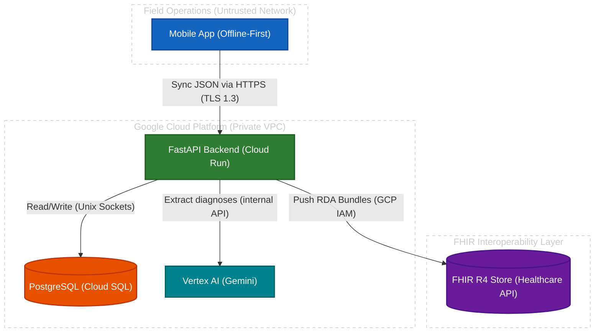

# Security Architecture & Protocols

This document outlines the security measures, cryptographic standards, and access control models implemented in the Health Without Borders API. The system follows a "Defense in Depth" strategy, securing Protected Health Information (PHI) and Personally Identifiable Information (PII) at the application, transport, and storage levels.

---

## 1. Authentication (AuthN)

Authentication uses the OAuth2 Password Flow with stateless JSON Web Tokens (JWT).

- **Signing Algorithm:** HS256 (HMAC with SHA-256) using a high-entropy `SECRET_KEY` injected at runtime.
- **Payload:** Contains only `sub` (user email) and `exp` (expiration). No PHI or PII in the token.
- **Token Lifespan:** 30-day expiration (`ACCESS_TOKEN_EXPIRE_MINUTES = 43200`) to support health units with intermittent connectivity.
- **Password Storage:** Bcrypt iterative hashing. Plaintext passwords are never stored.

---

## 2. Authorization (AuthZ) & Multi-Tenancy

Role-Based Access Control (RBAC) with strict multi-tenant isolation.

### 2.1. System Roles

| Role | Scope | Capabilities |
|---|---|---|
| `superadmin` | Global | Create organizations and provision `org_admin` users |
| `org_admin` | Organization | Manage `doctor` and `nurse` accounts within their organization |
| `doctor` | Organization | Full clinical access: read records, create patients, add medical history |
| `nurse` | Organization | Restricted: read records, add vaccines. Cannot add medical history |

### 2.2. Patient Authorization (Hardware 2FA)

For physical security in refugee or transit camps:

- **Adults (18+):** Scanning the NFC tag retrieves the medical record.
- **Minors (<18):** Access is blocked unless the guardian's NFC tag is also scanned and matches the registered guardian.

---

## 3. Data & Clinical Security

### 3.1. Encryption at Rest
- PostgreSQL on Google Cloud SQL encrypted with AES-256 (Google-managed keys).
- Automated backups are identically encrypted.

### 3.2. Encryption in Transit
- **External:** TLS 1.3 (HTTPS) between mobile clients and Cloud Run.
- **Internal:** Unix Sockets between Cloud Run and Cloud SQL.

### 3.3. Clinical Interoperability Security (FHIR)
FHIR RDA bundles sent to the Google Cloud Healthcare API are protected by:
- **IAM Service Accounts:** Scoped to `roles/healthcare.fhirResourceEditor`.
- **Cloud Audit Logs:** Every bundle ingestion triggers an immutable audit log entry.
- **Referential Integrity:** Enabled on the FHIR Store to prevent malformed references.
- **Resource Versioning:** Enabled to maintain a complete audit trail of all changes.

---

## 4. Infrastructure Security

### 4.1. Network Isolation
- Cloud SQL has no public IP — accessed via internal VPC routing or Unix sockets.
- Cloud Run instances are ephemeral (no persistent attack surface).

### 4.2. Secret Management
- Sensitive configurations injected at runtime via Google Secret Manager.
- No secrets committed to the Git repository.

---

## 5. Data Classification & Flow

### 5.1. Data Classification

| Category | Examples |
|---|---|
| Authentication (Sensitive) | Emails, hashed passwords, roles, organization IDs |
| PII | Patient names, dates of birth, guardian names, document numbers |
| PHI (Critical) | Patient IDs, device UIDs, medical history, diagnoses (ICD-10/11), allergies, vaccinations |

### 5.2. Data Flow

1. **Origin:** Tablet generates JSON payload (offline-first).
2. **Transit 1:** Tablet → Backend via HTTPS (TLS 1.3).
3. **Processing:** Cloud Run validates JWT/RBAC. Missing diagnoses inferred via Vertex AI (data NOT used for model training).
4. **Transit 2:** Backend → PostgreSQL via Unix Sockets.
5. **Transit 3:** Backend converts JSON to FHIR R4 RDA bundles → Cloud Healthcare API via HTTPS (GCP IAM).

