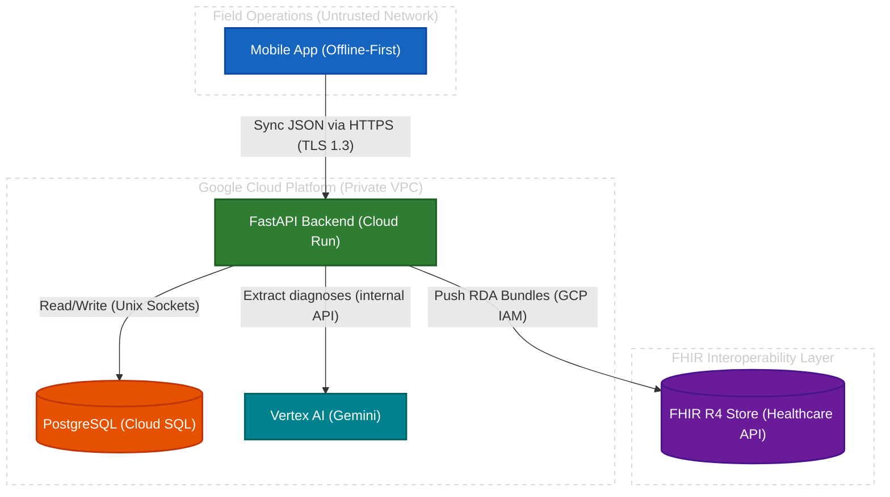

# Security Architecture & Protocols

This document outlines the security measures, cryptographic standards, and access control models implemented in the Health Without Borders API. The system follows a "Defense in Depth" strategy, securing Protected Health Information (PHI) and Personally Identifiable Information (PII) at the application, transport, and storage levels.

---

## 1. Authentication (AuthN)

Authentication uses the OAuth2 Password Flow with JSON Web Tokens (JWT). The system implements a **short-lived access token + long-lived refresh token** pattern with JTI-based revocation.

- **Signing Algorithm:** HS256 (HMAC with SHA-256) using a high-entropy `SECRET_KEY` injected at runtime.
- **Access Token:** Short-lived (default 60 minutes, configurable via `ACCESS_TOKEN_EXPIRE_MINUTES`). Used for every API call. Contains `sub` (the user's id; tokens issued before September 2026 carry the email), `exp` (expiration), `jti` (unique JWT ID for revocation), `tv` (the user's `token_version`) and `type` (`"access"`). No PHI or PII in the token.
- **Refresh Token:** Longer-lived (default 7 days, configurable via `REFRESH_TOKEN_EXPIRE_MINUTES`). Used **only** to obtain a new token pair via `POST /login/refresh`. Contains the same claims with `type` set to `"refresh"`. The old refresh token is revoked on each rotation to prevent reuse. A rotated token presented again means a copy exists, and every session of the user is revoked — except a retry after a lost response: within `REFRESH_RETRY_GRACE_SECONDS` (default 120 s) of the rotation, and while the token issued in its place is still unused, the retry gets a new pair and that unused token is revoked instead, so only one refresh token of the chain stays valid. Revocation is a single `INSERT … ON CONFLICT DO NOTHING`, so simultaneous refreshes or logouts with the same token never fail with a 500.
- **Token Revocation:** Tokens can be explicitly revoked via `POST /logout`. The `jti` claim is stored in the `revoked_tokens` database table and checked on every authenticated request. Revoked entries can be cleaned up after their original expiry passes.
- **Password Storage:** Bcrypt iterative hashing. Plaintext passwords are never stored.
- **Password Changes:** A user changes their own password with `POST /users/me/password` (the current one is required; the new one needs at least 12 characters, at most 72 bytes, and is checked against a list of common passwords; attempts share the login rate limit). Every other session of the user ends; the device that made the change gets a new token pair. An administrator (`superadmin`, or the `org_admin` for their own doctors and nurses) resets a password with `POST /users/{id}/reset-password`: the server generates a temporary password, returns it once, ends every session, and sets `must_change_password`, which the login response and `/users/me` report. Accounts created by an administrator start with the flag set. Neither password ever reaches the logs.

### 1.1. Token Flow

```
1. POST /login/access-token  →  { access_token, refresh_token, expires_in }
2. Use access_token in Authorization: Bearer header for all API calls
3. When access_token expires (401) → POST /login/refresh { refresh_token }
   → Returns new { access_token, refresh_token } (old refresh is revoked)
4. POST /logout  →  Revokes current access_token (204 No Content)
```

---

## 2. Authorization (AuthZ) & Multi-Tenancy

Role-Based Access Control (RBAC). Tenant isolation applies to **organization and user administration**; patient clinical records are intentionally **global** — any authenticated clinician may access any patient (see Database Schema § 3.1).

### 2.1. System Roles

| Role | Scope | Capabilities |
|---|---|---|
| `superadmin` | Global | Create organizations and provision `org_admin` users |
| `org_admin` | Organization | Manage `doctor` and `nurse` accounts within their organization |
| `doctor` | Organization | Full clinical access: read records, create patients, add medical history |
| `nurse` | Organization | Read records; add vaccines and change allergies, background, guardians and demographics. Cannot add visits (consultations) |

### 2.2. Patient Authorization (Hardware 2FA)

For physical security in refugee or transit camps:

- **Adults (18+):** Scanning the NFC tag retrieves the medical record.
- **Minors (<18):** Access is blocked unless the guardian's NFC tag is also scanned and matches the registered guardian.

---

## 3. Data & Clinical Security

### 3.1. Encryption at Rest
- PostgreSQL on Google Cloud SQL encrypted with AES-256 (Google-managed keys).
- NFC chip payloads encrypted with AES-256-GCM using a versioned keyring. See [NFC Key Management](nfc-key-management.md) for configuration, rotation and retirement.
- Cloud SQL backups are encrypted the same way. Backups are not on by default: enable them when creating the instance (see [GCP Deployment](gcp-deploy.md) § 2). On the pilot instance, daily backups (14 kept), point-in-time recovery (7 days) and deletion protection are on since 2026-10-02. A database backup is only usable together with a backup of `NFC_KEK` (see [Database](database.md) § 2.5).

### 3.2. Encryption in Transit
- **External:** TLS 1.3 (HTTPS) between mobile clients and Cloud Run.
- **Internal:** Unix Sockets between Cloud Run and Cloud SQL.

### 3.3. Clinical Interoperability Security (FHIR)
FHIR RDA bundles sent to the Google Cloud Healthcare API are protected by:
- **IAM Service Accounts:** The service calls the Healthcare API as its Cloud Run service account. **The pilot deployment uses the Compute Engine default account**, which holds `roles/editor` on the whole project (and reads the four secrets), so its reach is much wider than FHIR; the database user is `postgres`. The least-privilege setup is a dedicated account with `roles/healthcare.fhirResourceEditor` on the FHIR store, `roles/cloudsql.client`, `roles/aiplatform.user` and `roles/secretmanager.secretAccessor` on the four secrets, deployed with `--service-account` (see [Healthcare API](healthcare-api.md) § 4).
- **Cloud Audit Logs:** Every bundle ingestion triggers an immutable audit log entry.
- **Referential Integrity:** Enabled on the FHIR Store to prevent malformed references.
- **Resource Versioning:** Enabled to maintain a complete audit trail of all changes.

### 3.4. Access to Patient Records
Patient records are global: any `doctor`, `nurse` or `org_admin` can read any record, and `/search` returns a minor's record without the guardian's card. Every successful `/scan`, `/search` and `/sync` therefore writes one row to the append-only `patient_access_log` table **before** the record is returned: the authenticated actor, their organization, the channel, whether the guardian's card was presented and matched, the reason given on `/search` (`access_reason`, optional) and the server time. If that row cannot be written, the record is not served.

`POST /api/v1/patients/access-log` returns that history for one patient (by server `patient_id` or current bracelet `device_uid`, in the body): all of it for a `superadmin`, the accesses made by their own organization's users for an `org_admin`.

Offline break-glass accesses (a minor's record opened on the device without the guardian) are synced by the app to `emergency_access_log`, which stores the device-declared actor next to the authenticated user whose session uploaded the entry (`uploaded_by`). `occurred_at` must be ISO 8601; a value without an offset is read as local time in the reporting zone, and it is stored with its offset. `POST /api/v1/patients/access-log` returns these entries too (`emergency_entries`, for the patient's current and retired bracelets, scoped like the rest of the ledger).

Logs never carry a bracelet or guardian-card UID or a document number, not even in part: they show a reference (`ref:` plus 10 hex characters of an HMAC keyed with `SECRET_KEY`), the same for every line about the same value. At startup, the log warns when `SECRET_KEY` is shorter than 32 bytes or is the example value from `.env.example` (never showing the key).

Use `POST /api/v1/patients/scan` (UIDs in the body) rather than `GET /api/v1/patients/scan/{device_uid}`: a bracelet UID in the URL ends up in Cloud Run's request logs.

---

## 4. Infrastructure Security

### 4.1. Network Isolation
- Cloud SQL has no public IP — accessed via internal VPC routing or Unix sockets.
- Cloud Run instances are ephemeral (no persistent attack surface).

### 4.2. Secret Management
- Sensitive configurations injected at runtime via Google Secret Manager.
- No secrets committed to the Git repository.

### 4.3. Rate Limiting

API endpoints that are vulnerable to brute-force attacks (`/login/access-token`, `/patients/search`) enforce per-client request limits using [SlowAPI](https://github.com/laurents/slowapi).

- **Backend Storage:** Redis when `REDIS_URL` is set, shared across all Cloud Run instances. **The current deployment does not set it**, so each instance counts in its own memory (the effective limit is multiplied by the number of instances and resets on cold start). Redis is not provisioned on purpose: the per-account limit below, kept in PostgreSQL, is what stops guessing an account's password from many addresses or instances.
- **Client IP Detection:** Extracted from the `X-Forwarded-For` header set by Cloud Run's load balancer, ensuring rate limits apply per real client rather than per proxy.
- **Default Limits:** `10/minute` for login, `30/minute` for patient search. Configurable via `RATE_LIMIT_LOGIN` and `RATE_LIMIT_PATIENT_SEARCH` environment variables.

**Per-account limit on failed sign-ins.** Independent of the address and of the instance: failures are counted per account in PostgreSQL (`login_failures`, shared by every instance, no Redis needed).

- After `LOGIN_FAILURES_BEFORE_DELAY` (5) failures within `LOGIN_FAILURE_WINDOW_SECONDS` (15 min), the account is **paused** for `LOGIN_DELAY_BASE_SECONDS` (60 s). Each further failure doubles the pause, up to `LOGIN_DELAY_MAX_SECONDS` (15 min).
- While paused, every attempt gets `429` with `code: login_paused` and `Retry-After`, even with the right password, so the guessing cannot go on.
- A wrong current password in `POST /users/me/password` counts the same way.
- A successful sign-in, or an administrator's reset (`POST /users/{id}/reset-password`), clears the count.
- **Trade-off:** someone who knows a user's email can delay that user's sign-in by up to 15 minutes at a time, but never lock the account for good. That is why it is a pause and not a lockout.
- The table stores an HMAC of the email, never the email itself (not even for accounts that do not exist), and an unknown email is paused exactly like a real one, so the limit reveals nothing about which accounts exist.

---

## 5. Data Classification & Flow

### 5.1. Data Classification

| Category | Examples |
|---|---|
| Authentication (Sensitive) | Emails, hashed passwords, roles, organization IDs |
| PII | Patient names, dates of birth, guardian names, document numbers |
| PHI (Critical) | Patient IDs, device UIDs, medical history, diagnoses (ICD-10/11), allergies, vaccinations |

### 5.2. Data Flow

1. **Origin:** Tablet generates JSON payload (offline-first).
2. **Transit 1:** Tablet → Backend via HTTPS (TLS 1.3).
3. **Processing:** Cloud Run validates JWT/RBAC. Missing diagnoses inferred via Vertex AI (data NOT used for model training).
4. **Transit 2:** Backend → PostgreSQL via Unix Sockets.
5. **Transit 3:** Backend converts JSON to FHIR R4 RDA bundles → Cloud Healthcare API via HTTPS (GCP IAM).


```mermaid
flowchart TD
    classDef mobile fill:#1565c0,stroke:#0d47a1,stroke-width:2px,color:white;
    classDef backend fill:#2e7d32,stroke:#1b5e20,stroke-width:2px,color:white;
    classDef database fill:#e65100,stroke:#bf360c,stroke-width:2px,color:white;
    classDef healthcare fill:#6a1b9a,stroke:#4a148c,stroke-width:2px,color:white;
    classDef ai fill:#00838f,stroke:#006064,stroke-width:2px,color:white;

    subgraph FieldZone ["Field Operations (Untrusted Network)"]
        style FieldZone fill:none,stroke:#ccc,stroke-width:1px,color:#ccc,stroke-dasharray: 5 5
        Tablet["Mobile App (Offline-First)"]:::mobile
    end

    subgraph GCPZone ["Google Cloud Platform (Private VPC)"]
        style GCPZone fill:none,stroke:#ccc,stroke-width:1px,color:#ccc,stroke-dasharray: 5 5
        API["FastAPI Backend (Cloud Run)"]:::backend
        DB[("PostgreSQL (Cloud SQL)")]:::database
        VertexAI["Vertex AI (Gemini)"]:::ai
    end

    subgraph FHIRZone ["FHIR Interoperability Layer"]
        style FHIRZone fill:none,stroke:#ccc,stroke-width:1px,color:#ccc,stroke-dasharray: 5 5
        FHIRStore[("FHIR R4 Store (Healthcare API)")]:::healthcare
    end

    Tablet -- "Sync JSON via HTTPS (TLS 1.3)" --> API
    API -- "Extract diagnoses (internal API)" --> VertexAI
    API -- "Read/Write (Unix Sockets)" --> DB
    API -- "Push RDA Bundles (GCP IAM)" --> FHIRStore
```